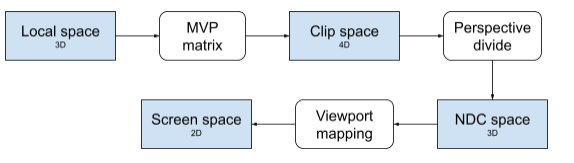
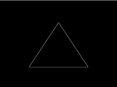
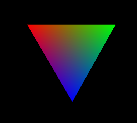
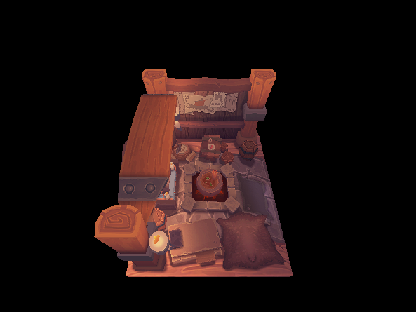
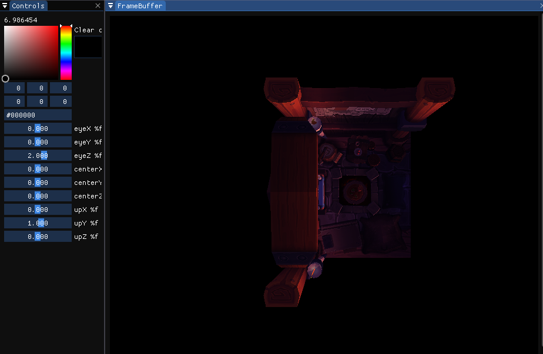

SoftwareRenderer Rasterizer    
===============   

Description      
------------      

This project's purpose is to realise a fully 3D renderer Software.    

# Architecture    
<pre>
├── renderer.sln   
├── app   
│   ├── app.vcxproj   
│   ├── src   
│   │   └── main.cpp   
|   └── assets
|       ├── 3dObjectLight.png
|       ├── girl.jpeg
|       ├── rd_shit.jpeg
|       ├── viking_room.jpeg
|       ├── viking_room.obj
|       ├── triangleWireframe.png
|       ├── triangleInterpolation.png
|       └── schemaSpace.png
|       
│── External  
|       ├── Glad ( Folder )
|       ├── ImGui ( Folder )
|       ├── TinyObj ( Folder )
|       └── ToolBox
|               ├── matrix.cpp
|               ├── Matrix4x4.cpp
|               ├── vector.cpp
|               ├── Vector3.cpp
|               └── Vector4.cpp
|       
│── renderer   
│   ├── renderer.vcxproj   
│   ├── include   
│   │   └── rdr   
|   │        ├── light.h
|   │        ├── Texture.h
|   │        ├── Vertex.h
│   │        └── renderer.h   
│   └── src   
│       ├── renderer.cpp   
│       ├── renderer_impl.hpp   
│       ├── Texture.cpp
│       ├── Vertex.cpp
│       └── light.cpp 
└── scene   
    ├── scene.vcxproj   
    ├── include   
    │└── scn   
    │   └── scene.h   
    └── src   
        ├── scene.cpp   
        └── scene_impl.hpp   
 
</pre>
# FeaturesRenderer    

## Implementation of rendering pipeline        

- Transformation Model/View/Projection/viewport   
- Triangle's filling      
- Colors interpolation   
- Textures interpolation + Loading    
- Depth test / 3D object    
- Model of illumination ( Phong )    
    - Support de 8 lights (position,color,power,attenuation) ( not have attenuation in this project)    
    - Configuration of materiel (emissive,ambient,diffuse,specular) (not have specular in this project)    

## Directive    

Before starting, there are some links at the end of this ReadMe that help understand how did I do all my steps.      
    
Above all, we need to change our local coords to screen coords using Model / View / Pojection and ViewPort Matrixes.      
To understand how it work; bellow, you have a schema of steps to do to pass of Local space to Screen space.      
      
   
We started by displaying a wireframe Triangle.    
It will display something comparable to the Image bellow.   
   
     
Then, we fill the triangle using color interpolation.      
Interpolation is a type of estimation that finds new data points based on the range of a discrete set of known data points.        
When used in the context of color, it is finding one or more colors that reside between any two given colors.       
   

3D object :
    

3D object with Ambient / Diffuse Lights (not specular) : 
    

IMGUI :     

Library used 
-------------

- GLFW3   
- IMGUI   
- GLAD   
- KHR   
- STD_IMAGE   
- TINYOBJ   
- ToolBox ( personnal math library that contains matrix and vectors)

Made with
------------
- VisualStudio
- C++

Interesting Link
----------------

- Color interpolation : https://codeplea.com/triangular-interpolation   
- Texture : https://learnopengl.com/Getting-started/Textures     
- Camera understanding : https://www.geertarien.com/blog/2017/07/30/breakdown-of-the-lookAt-function-in-OpenGL/    
- 3D model loader : https://vulkan-tutorial.com/Loading_models   

